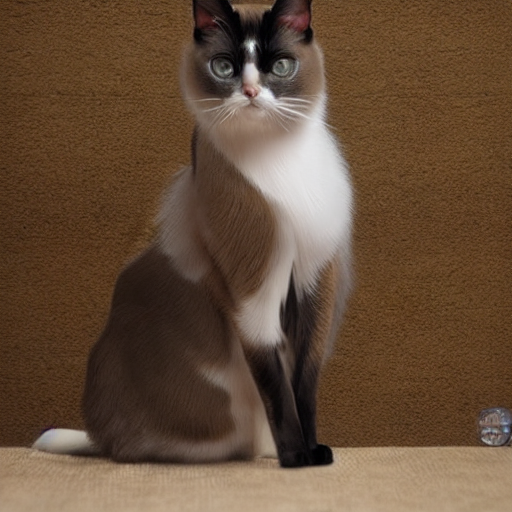

# Overview

This lab evaluates different learning paradigms on a synthetic cat-species dataset containing **42 fine-grained classes** with limited samples per class.

## Sample images from dataset : 

## Models & Results

### Supervised Learning (Pretrained)
- **Model:** ResNet-50 (ImageNet pretrained)  
- **Accuracy:** 91.67%

### Supervised Learning
- **Model:** Custom Res-SE-CNN (trained from scratch)  
- **Accuracy:** 15.87%

### Few-Shot Learning (5-way)
- **Accuracy:** 84.0%

### Zero-Shot Learning
- **Accuracy:** 42.14%

### Continual Learning 
- **Average Accuracy:** 13.29%

## Class Imbalance

The dataset exhibits **severe class imbalance**, with many classes containing only **1–3 images** and some classes missing in evaluation splits. This significantly impacts supervised and continual learning performance, leading to low macro F1-scores and unstable per-class metrics.

### Handling Class Imbalance

Accuracy can be improved by:
1. Using class-weighted loss  
2. Applying stratified train/validation/test splits  
3. Oversampling minority classes  
4. Applying stronger data augmentation to rare classes  

## Key Observation

Few-shot and zero-shot learning outperform supervised training from scratch, highlighting the importance of representation learning under data imbalance.

